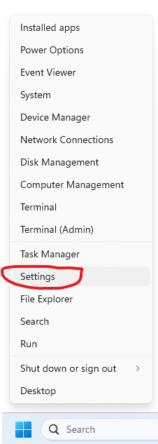
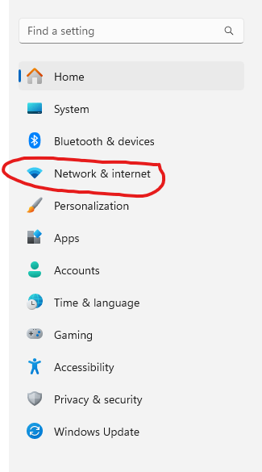
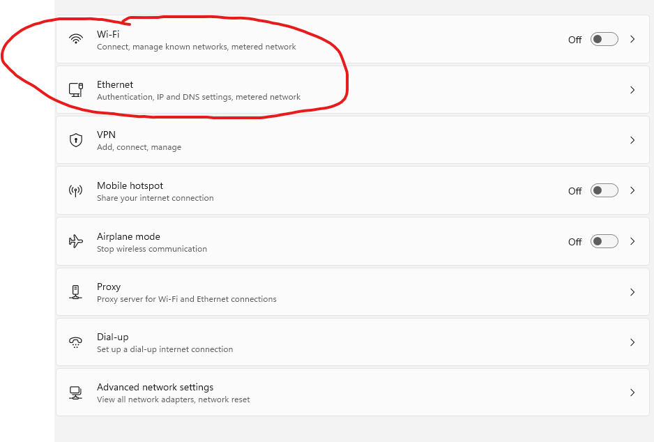
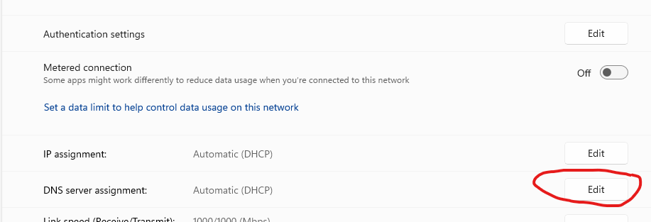
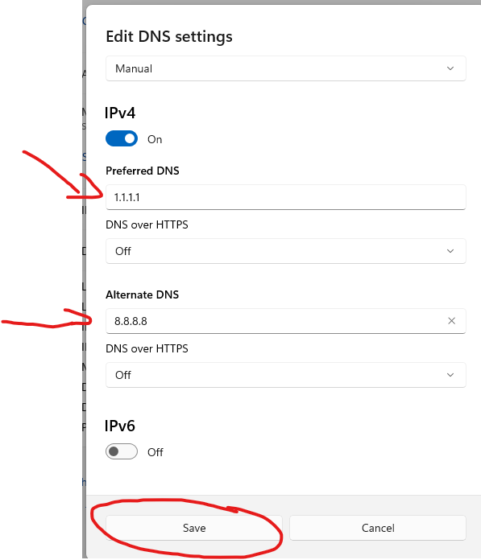

# How to change your DNS on Windows 11
This guide will teach you how to change your DNS server in just 6 quick steps!

Step 1: Right click the windows icon in the bottom left of your screen and select settings.

Step 2: Select Network & Internet 

Step 3: Select either Wi-fi or Ethernet depending on which one you are using.

Step 4: Select Edit in the DNS Server Assignment bar

Step 5: Click on the drop down box and select Manual and tick the IPv4 on.

Step 6: Enter your desired DNS server address into the primary and secondary areas then hit save. 

That's how easy it is. Below is a table of a few of the most reputable and popular DNS servers. Although Automatic DNS works perfectly fine most of the time, it's always good to know how to manually change your DNS because sometimes thats the reason your failing to connect.

| DNS Provider | Primary IP | Secondary IP |
| ------ | ------ | ------ |
| Cloudflare | 1.1.1.1 | 1.0.0.1 |
| Google | 8.8.8.8 | 8.8.4.4 |
| NordVPN | 103.86.96.100 | 45.90.30.190 |

[Home Page](README.md)